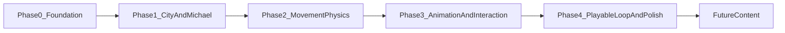

# Parkour Project Plan

## Current Starting Point

- The repo is a minimal Vite + TypeScript scaffold, with the app still rendering placeholder content in [`/home/skyguy/foss/parkour/src/main.ts`](/home/skyguy/foss/parkour/src/main.ts).
- The main product requirements live in [`/home/skyguy/foss/parkour/docs/spec_v3.md`](/home/skyguy/foss/parkour/docs/spec_v3.md), especially:
  - 300x300m Florence district with 2-floor rooftop traversal
  - Michael Scott as the playable character
  - 8-move traversal kit, no fall damage, open-world exploration focus

## Delivery Phases

## Phase 0: Technical Foundation

Goal: turn the scaffold into a real-time game app with clear systems boundaries.

- Set up a `src/game` architecture for app bootstrap, render loop, input, camera, physics state, world state, and asset loading.
- Choose and integrate the runtime stack for 3D rendering and animation. A practical default is `three` plus a lightweight physics/collision approach first, then only add heavier dependencies if needed.
- Define coordinate conventions and core constants from the spec early: rooftop height around 7m, world footprint 300x300m, jump/leap/wall-run metrics, no-fall-damage recovery.
- Add debug overlays from the beginning: FPS, player position, grounded/airborne/wall state, current move, nearby interactables.

Files likely introduced first:

- [`/home/skyguy/foss/parkour/src/main.ts`](/home/skyguy/foss/parkour/src/main.ts)
- [`/home/skyguy/foss/parkour/src/game/`](/home/skyguy/foss/parkour/src/game/)
- [`/home/skyguy/foss/parkour/src/styles/main.css`](/home/skyguy/foss/parkour/src/styles/main.css)

## Phase 1: City And Michael

Goal: get a believable Florence block and a visible playable Michael into the world before movement complexity.

### 1.1 Build the first playable district slice

- Start with a hand-authored graybox slice, not full procedural generation.
- Include one plaza, 2-3 street types, 1-2 alley types, a rooftop network, and 3-4 representative building modules.
- Prioritize the spec's traversal geometry rules over visual detail:
  - parkour starters near streets
  - rooftop gaps <= 2.5m
  - climbable ledges/handholds every 2-3m
  - distinct wall-run materials on brick/stone surfaces
- Add one strong landmark silhouette early, likely a simplified Duomo-inspired building, to validate navigation readability.

### 1.2 Establish modular city content

- Create reusable building/obstacle modules matching the spec's common pieces:
  - residential
  - commercial
  - palazzo/stone building
  - market stall, crate cluster, barrel stack
  - alley and plaza chunks
- Store module metadata with traversal tags such as `climbable`, `vaultable`, `wallRunnable`, `ledge`, `openPassage` so later movement logic reads from the environment instead of hardcoding per-mesh behavior.

### 1.3 Add Michael as a readable character

- Implement a temporary but recognizable Michael model first: stocky proportions, gray polo, dark slacks, navy tie, visible badge.
- Ensure silhouette readability from the default camera distance before investing in high-detail rigging.
- If custom art is not ready, use a simple rigged proxy mesh with color-blocked costume pieces and a separate tie/badge attachment.

Exit criteria for Phase 1:

- You can spawn Michael on a rooftop in a small Florence slice.
- The environment already communicates what is climbable, vaultable, or wall-runnable.
- Traversal routes are visible even before advanced movement exists.

## Phase 2: Movement Physics

Goal: make traversal mechanically reliable before chasing animation polish.

### 2.1 Implement the core locomotion state machine

- Start with the smallest reliable set:
  - run
  - sprint
  - jump
  - fall
  - land
  - climb
- Then layer in context-sensitive traversal:
  - vault
  - leap
  - wall-run
  - roll
  - slide
- Drive all moves from a shared movement state machine and movement query system, not isolated one-off scripts.

### 2.2 Tune movement against the spec metrics

- Use the physics constants in [`/home/skyguy/foss/parkour/docs/spec_v3.md`](/home/skyguy/foss/parkour/docs/spec_v3.md) as the baseline and tune in-engine:
  - `RUN_SPEED`, `SPRINT_SPEED`
  - `JUMP_VELOCITY`, `LEAP_VELOCITY`
  - `COYOTE_TIME`, `JUMP_BUFFER`, `LANDING_GRACE`
  - `WALL_RUN_DURATION`, `WALL_RUN_SPEED`, `WALL_PUSH_VELOCITY`
- Build small test corridors for each move type so tuning is repeatable rather than relying on the full city every time.

### 2.3 Make the city queryable by movement

- Add environment probes/collision helpers that answer questions like:
  - is there vaultable geometry ahead?
  - is this wall climbable or wall-runnable?
  - is there a ledge to grab at this height?
  - is the landing zone safe?
- Keep this layer deterministic and debuggable with visual gizmos.

Exit criteria for Phase 2:

- Michael can reliably traverse a rooftop route, recover from misses, and use ground-to-rooftop starters.
- Movement feels forgiving and chainable, even if animation is still simple.
- Falling is a recovery beat, not a fail state.

## Phase 3: Smooth Animation And Environmental Interaction

Goal: preserve control responsiveness while making movement look and feel fluid.

### 3.1 Introduce animation blending around gameplay states

- Create/retarget the minimum animation set for idle, run, sprint, jump takeoff, airborne, land, vault, climb, wall-run, roll, and slide.
- Blend animations from gameplay state and velocity rather than baking traversal as long locked sequences.
- Keep cancel windows and input buffering intact so polish does not make controls sluggish.

### 3.2 Add secondary motion and comedy beats

- Simulate or procedurally animate Michael's tie and badge.
- Add exaggerated recovery poses for missed jumps, rooftop drops, and awkward landings.
- Use camera support lightly: look-ahead, subtle landing shake, mild airborne tilt from the spec.

### 3.3 Deepen city interaction feedback

- Make crates, stalls, balconies, open windows, ledges, and archways produce distinct traversal responses.
- Improve contact handling so movement transitions are smooth when moving from ground to obstacle to wall to rooftop.
- Add material-driven feedback hooks for later VFX/SFX, even if audio is deferred.

Exit criteria for Phase 3:

- Traversal looks smooth without losing precision.
- City objects feel intentionally designed for parkour, not like static scenery.
- Michael's personality starts to come through visually.

## Phase 4: Playable Loop And Jam-Ready Polish

Goal: turn the prototype into a cohesive exploration build.

- Expand from the graybox slice toward the spec's larger Florence district, keeping rooftop connectivity validated as content grows.
- Add spawn/respawn rules, altitude indicator, coordinate HUD, controls hint fade, and safe-rooftop recovery.
- Improve lighting, material readability, landmark visibility, and route readability from rooftop viewpoints.
- Only after movement is solid, decide whether to invest in procedural district generation for the full 300x300m map or ship a curated handcrafted district for jam scope.

## Deferred Until After The Above

These stay intentionally out of the first build unless the earlier phases are already stable:

- full procedural city generation at scale
- time trials and leaderboards
- multiple eras/cities
- audio and voice lines
- mobile controls
- guard/chase systems

## Recommended Build Order Inside The First Two Aims

1. Stand up `src/game` systems and 3D scene bootstrap.
2. Graybox one Florence district slice with rooftops, alleys, plaza, and parkour starter props.
3. Add Michael proxy model with camera follow and rooftop spawn.
4. Implement reliable run/jump/fall/land/climb.
5. Add vault/leap/wall-run/roll/slide against traversal-tagged geometry.
6. Only then spend time on animation smoothing, tie physics, and richer interaction polish.

## Key Decision To Revisit After Phase 2

Once the city slice and movement feel good, decide whether the next milestone is:

- scaling to a full procedural Florence district, or
- polishing a smaller handcrafted district into a stronger jam-quality vertical slice

For now, the safer plan is to optimize for a polished vertical slice first, because the repo is starting from near-zero implementation and the movement system is the highest project risk.
