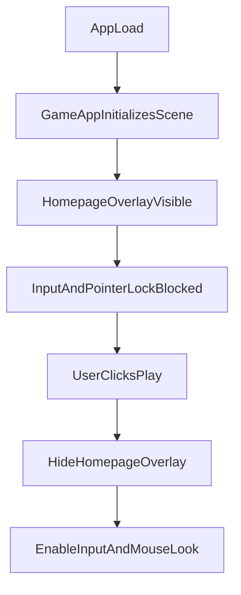

# Michael in Florence Homepage Plan

## Desired Experience

- App opens directly to a cinematic homepage overlay (no route changes).
- Michael + Florence world are visible in the background, but movement/camera input is fully disabled.
- Clicking `Play` hides homepage content and immediately enables gameplay input.

## Homepage Content (Lore-Aligned)

- **Title:** `Michael in Florence`
- **Subtitle:** `An accidental office manager. A city of rooftops. A very confident lack of training.`
- **Body copy (short):** one-paragraph setup from spec lore: Michael isekai'd from Dunder Mifflin into 15th-century Florence, determined to free-run anyway.
- **Primary CTA:** `Play`
- **Secondary hint text:** controls reminder shown near CTA (`WASD`, `Space`, `Shift`, `R`) to match spec’s first-load guidance.

## Implementation Approach (No Rerouting)

- Keep startup in a single entry (`src/main.ts`) and render the game immediately as today.
- Add a lightweight UI layer mounted in the same root container (or inside `GameApp` host) that sits above the canvas.
- Use a boolean game phase (`intro` vs `playing`) to gate all input handling.

## Target File Changes

- [`src/game/gameApp.ts`](src/game/gameApp.ts)
  - Add intro state and methods like `startIntro()`, `startPlaying()`.
  - Prevent movement/camera updates while intro is active (feed zero movement and ignore jump/camera rotate).
  - Gate pointer lock: disable current auto-lock-on-canvas-click during intro; request pointer lock only once Play is clicked (same user gesture), with canvas-click fallback if browser denies.
- [`src/game/input/inputController.ts`](src/game/input/inputController.ts)
  - Add enable/disable gate (e.g., `setEnabled(boolean)`) so key events are ignored while homepage is visible.
  - Clear pressed keys when toggling from disabled -> enabled/disabled to avoid sticky input.
- [`src/main.ts`](src/main.ts)
  - Wire homepage overlay creation and Play button handler.
  - On Play: call game method to transition phase and remove/hide homepage DOM.
- [`src/styles/main.css`](src/styles/main.css)
  - Add homepage overlay styling (full-screen, translucent gradient, readable text panel, CTA button, responsive layout).
  - Keep existing HUD visible rules explicit (homepage can hide/debug overlay can be de-emphasized if needed).
- (Optional cleanup) [`src/game/debug/debugHud.ts`](src/game/debug/debugHud.ts)
  - Temporarily suppress “click to lock mouse” prompt during intro so UX messaging is not contradictory.

## Acceptance Criteria

- Reloading the app always shows homepage first.
- Michael/city remain rendered behind homepage (background is live scene, not static image).
- Keyboard and mouse input do nothing before Play.
- Clicking `Play` removes homepage content and enables full control immediately.
- No URL/path changes are introduced.

## Verification Plan

- Manual test: reload page, verify overlay appears before any movement.
- Hold movement keys before clicking Play, then click Play; ensure no stuck movement occurs.
- Verify pointer lock behavior: Play enters gameplay, mouse look works (or one click fallback if browser blocks direct lock).
- Confirm no regression to resize handling or render loop performance.
