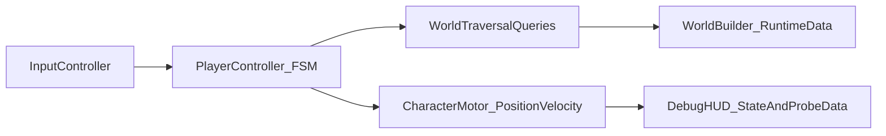

# Phase 2 Implementation Plan (Movement Physics)

## Goal

Deliver a mechanically reliable, chainable traversal system on top of the existing movement foundation in [`.cursor/plans/000_parkour-project-phases.plan.md`](/home/skyguy/foss/parkour/.cursor/plans/000_parkour-project-phases.plan.md), centered on deterministic state transitions, query-driven traversal detection, and spec-based tuning from [`docs/spec_v3.md`](/home/skyguy/foss/parkour/docs/spec_v3.md).

## Current Baseline (What We Build On)

- A basic controller already supports `run/sprint/jump/fall/land` in [`src/game/player/playerController.ts`](/home/skyguy/foss/parkour/src/game/player/playerController.ts).
- Input buffering and coyote timing are partially wired via [`src/game/gameApp.ts`](/home/skyguy/foss/parkour/src/game/gameApp.ts) and [`src/game/constants.ts`](/home/skyguy/foss/parkour/src/game/constants.ts).
- Traversal tags and authored geometry already exist in [`src/game/world/worldTypes.ts`](/home/skyguy/foss/parkour/src/game/world/worldTypes.ts), [`src/game/world/districtSlice.ts`](/home/skyguy/foss/parkour/src/game/world/districtSlice.ts), and world runtime logic in [`src/game/world/worldBuilder.ts`](/home/skyguy/foss/parkour/src/game/world/worldBuilder.ts).

## Architecture For Phase 2

## Workstream 1: Expand Movement Domain Model

- Extend movement states in [`src/game/types.ts`](/home/skyguy/foss/parkour/src/game/types.ts) to include `climb`, `vault`, `leap`, `wallRun`, `roll`, and `slide`.
- Expand physics constants in [`src/game/constants.ts`](/home/skyguy/foss/parkour/src/game/constants.ts) to include spec-aligned timings/speeds (`LEAP_VELOCITY`, `VAULT_DURATION`, `WALL_RUN_DURATION`, `WALL_RUN_SPEED`, `ROLL_DURATION`, `SLIDE_DURATION`, `LANDING_GRACE`, wall push values).
- Keep naming and units identical to [`docs/spec_v3.md`](/home/skyguy/foss/parkour/docs/spec_v3.md) to make tuning and comparison direct.

## Workstream 2: Refactor Player Controller Into Explicit FSM + Motor

- In [`src/game/player/playerController.ts`](/home/skyguy/foss/parkour/src/game/player/playerController.ts), separate concerns into:
  - transition guards (when state changes are legal),
  - per-state update handlers (movement behavior),
  - shared motor step (gravity, horizontal acceleration, collision resolution).
- Add transition priority rules so context-sensitive traversal resolves consistently (example: wall-run candidate beats plain fall when valid).
- Preserve responsiveness guarantees: coyote time, jump buffer, and landing grace all remain active through transitions.

## Workstream 3: Build Deterministic Traversal Query Layer

- Introduce a dedicated query layer (new helper module under [`src/game/world/`](/home/skyguy/foss/parkour/src/game/world/), likely alongside [`src/game/world/worldBuilder.ts`](/home/skyguy/foss/parkour/src/game/world/worldBuilder.ts)) that answers:
  - vault candidate ahead,
  - climbable wall and reachable ledge,
  - wall-runnable surface with run direction,
  - safe landing surface/zone.
- Source data from existing module tags (`climbable`, `vaultable`, `wallRunnable`, `ledge`) and runtime bounds.
- Return structured probe results (not booleans only) so the controller can choose actions and expose debug context.

## Workstream 4: Add Traversal Moves Incrementally

- Add moves in this order to reduce risk and isolate regressions:
  1) `climb` (ground-to-rooftop connectors)
  2) `vault` (low obstacle flow)
  3) `leap` (gap crossing)
  4) `wallRun` (lateral traversal)
  5) `roll` and `slide` (recovery and ground flow)
- After each move integration, validate entry/exit transitions with existing base locomotion before adding the next move.
- Keep fail cases non-punishing per spec (misses return to grounded recovery, no fail-state behavior).

## Workstream 5: Create Movement Test Corridors

- Add a compact “movement gym” layout in [`src/game/world/districtSlice.ts`](/home/skyguy/foss/parkour/src/game/world/districtSlice.ts) using known distances/heights:
  - repeatable vault lines,
  - rooftop gap series at expected leap ranges,
  - wall-run alley segments,
  - climb starter walls/ledges every 2–3m.
- Expose one spawn point in that corridor for rapid iteration and deterministic retests.

## Workstream 6: Observability, Tuning, and Exit Gates

- Extend HUD telemetry in [`src/game/debug/debugHud.ts`](/home/skyguy/foss/parkour/src/game/debug/debugHud.ts) to show active move, probe hits, timers (coyote/buffer/grace), and transition reasons.
- Tune constants against [`docs/spec_v3.md`](/home/skyguy/foss/parkour/docs/spec_v3.md) in short iteration loops: adjust one parameter family at a time (jump/leap, then wall-run, then recovery windows).
- Exit checks for Phase 2:
  - rooftop route can be chained reliably,
  - misses recover quickly without frustration,
  - all traversal tags drive behavior through queries (no per-mesh hardcoded move logic).

## Suggested Implementation Order

1. Domain/state + constants expansion.
2. Player controller FSM refactor.
3. Traversal query helpers + API wiring from world to player update.
4. Incremental move integration in priority order.
5. Test corridor authoring and dedicated spawn.
6. Telemetry pass and spec-metric tuning pass.
