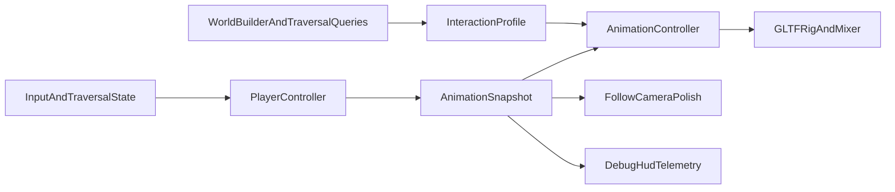

# Phase 3 Implementation Plan

## Goal

Deliver Phase 3 from [`.cursor/plans/000_parkour_project_phases.plan.md`](/home/skyguy/foss/parkour/.cursor/plans/000_parkour_project_phases.plan.md) by layering animation blending, secondary motion, camera support, and richer environmental traversal feedback on top of the existing Phase 2 movement/controller foundation instead of rewriting movement logic.

## Current Baseline

- [`src/game/player/playerController.ts`](/home/skyguy/foss/parkour/src/game/player/playerController.ts) already owns traversal state, move entry, timers, and Michael’s current box-proxy presentation.
- [`src/game/types.ts`](/home/skyguy/foss/parkour/src/game/types.ts) already exposes `MovementState` and a compact `PlayerSnapshot`, but it does not yet include enough animation-facing signals such as planar speed, landing intensity, or structured interaction kind.
- [`src/game/world/traversalQueries.ts`](/home/skyguy/foss/parkour/src/game/world/traversalQueries.ts) and [`src/game/world/worldBuilder.ts`](/home/skyguy/foss/parkour/src/game/world/worldBuilder.ts) already provide deterministic probe results and nearby traversal metadata, which should remain the source of truth for environment-driven animation choices.
- [`src/game/world/worldTypes.ts`](/home/skyguy/foss/parkour/src/game/world/worldTypes.ts) already has useful hooks for Phase 3 (`MaterialKind`, `ModuleArchetype`, traversal tags), but the current runtime snapshot only surfaces labels/tags rather than structured animation-feedback data.
- [`src/game/camera/followCamera.ts`](/home/skyguy/foss/parkour/src/game/camera/followCamera.ts) follows the player cleanly, but it does not yet use the existing `CAMERA.LOOK_AHEAD` value from [`src/game/constants.ts`](/home/skyguy/foss/parkour/src/game/constants.ts) and has no landing shake or airborne tilt.

## Architecture Target

## Workstream 1: Asset Runtime And Rig Attachment

- Add a dedicated animation asset runtime under [`src/game/player/`](/home/skyguy/foss/parkour/src/game/player/) or [`src/game/assets/`](/home/skyguy/foss/parkour/src/game/assets/) for loading [`assets/michael_v0.glb`](/home/skyguy/foss/parkour/assets/michael_v0.glb) and movement clips from [`assets/movements/`](/home/skyguy/foss/parkour/assets/movements/).
- Keep the existing proxy path as a development fallback until the GLB path is stable so movement iteration does not block on asset integration.
- Normalize clip naming up front so gameplay code refers to semantic ids like `idle`, `run`, `vault`, and `wallRun`, not raw filenames.

Likely files:

- [`src/game/player/playerController.ts`](/home/skyguy/foss/parkour/src/game/player/playerController.ts)
- [`src/game/player/`](/home/skyguy/foss/parkour/src/game/player/)
- [`src/game/assets/`](/home/skyguy/foss/parkour/src/game/assets/)

## Workstream 2: Animation Snapshot And State Mapping

- Extend [`src/game/types.ts`](/home/skyguy/foss/parkour/src/game/types.ts) with animation-facing fields so rendering/polish decisions are driven by stable runtime data rather than by poking directly into controller internals.
- Introduce a small `AnimationSnapshot` or expand `PlayerSnapshot` to include at least:
  - planar speed,
  - vertical speed,
  - landing impact severity,
  - current traversal interaction kind,
  - current environment material/archetype when relevant.
- Keep [`src/game/player/playerController.ts`](/home/skyguy/foss/parkour/src/game/player/playerController.ts) as the source of truth for movement timing, while the animation layer remains a consumer of those signals.

## Workstream 3: Blending Controller And Clip Library

- Add a dedicated animation controller module that maps `MovementState` plus interaction context to locomotion loops, traversal one-shots, and recovery clips.
- Blend by state and measured motion instead of turning parkour moves into long uninterruptible sequences; preserve the responsiveness guarantees from Phase 2.
- Treat traversal clips in two buckets:
  - locomotion loops: idle, run, sprint, airborne,
  - event clips: jump takeoff, land, vault, climb, wall-run, roll, slide, leap, stumble/recovery.
- Add debug-visible fallbacks so missing clips degrade gracefully to nearby equivalents during integration.

Likely new files:

- [`src/game/player/animationController.ts`](/home/skyguy/foss/parkour/src/game/player/animationController.ts)
- [`src/game/player/michaelRig.ts`](/home/skyguy/foss/parkour/src/game/player/michaelRig.ts)

## Workstream 4: Secondary Motion And Comedy Beats

- Replace the static tie/badge presentation inside [`src/game/player/playerController.ts`](/home/skyguy/foss/parkour/src/game/player/playerController.ts) with either bone-driven or lightweight procedural spring motion tied to acceleration, direction change, and vertical motion.
- Add a small recovery/comedy hook layer for awkward landings, rooftop drops, and missed-jump saves, but keep these as short additive or replaceable reactions instead of heavy control locks.
- Use the spec’s “falling is a comedy beat, not failure” rule from [`docs/spec_v3.md`](/home/skyguy/foss/parkour/docs/spec_v3.md) to decide where a special recovery clip is justified.

## Workstream 5: Camera Support And Feel Polish

- Update [`src/game/camera/followCamera.ts`](/home/skyguy/foss/parkour/src/game/camera/followCamera.ts) to consume animation/player motion signals for:
  - forward look-ahead using `CAMERA.LOOK_AHEAD`,
  - subtle landing shake on hard impacts,
  - mild airborne tilt during jumps, leaps, and wall-runs.
- Keep camera changes intentionally light so the city remains readable and the player retains strong spatial awareness.

## Workstream 6: Environment-Specific Interaction Feedback

- Extend [`src/game/world/worldBuilder.ts`](/home/skyguy/foss/parkour/src/game/world/worldBuilder.ts) and/or [`src/game/types.ts`](/home/skyguy/foss/parkour/src/game/types.ts) so the runtime exposes structured interaction feedback, not just tag lists.
- Reuse `ModuleArchetype` and `MaterialKind` from [`src/game/world/worldTypes.ts`](/home/skyguy/foss/parkour/src/game/world/worldTypes.ts) to distinguish responses such as:
  - crate/stall vaults,
  - archway slide-throughs,
  - brick/stone wall-runs,
  - rooftop-edge ledge recoveries.
- Use that context to pick more appropriate clips, landing offsets, camera reactions, and future VFX/SFX hooks.

## Workstream 7: Debuggability, Validation, And Exit Gates

- Extend [`src/game/debug/debugHud.ts`](/home/skyguy/foss/parkour/src/game/debug/debugHud.ts) to show current clip, blend target, interaction kind, and missing-asset fallback status.
- Validate one repeatable route through the authored district and movement gym that exercises: run, sprint, jump/leap, climb, vault, wall-run, roll/land, and slide.
- Use the existing district slice in [`src/game/world/districtSlice.ts`](/home/skyguy/foss/parkour/src/game/world/districtSlice.ts) as the first acceptance environment before adding more city variety.

## Required GLB Additions Beyond Current `assets/` And `assets/movements/`

The current GLB set already covers Michael’s rig plus `idle_1`, `running`, `sprinting`, `jumping_down`, `jumping_over_obstacle_with_two_hand_planted`, `landing_hard`, `climbing_up_wall`, `falling_to_roll_land`, and `flying_low_jump_roll_to_run`.

For the minimum Phase 3 clip set, these are the most important missing GLBs to source or export next:

- `jump_takeoff.glb`: Michael crouches, swings his arms, and launches into a normal jump from flat ground or a roof edge.
- `airborne.glb`: Michael is mid-air, correcting himself with small arm and torso adjustments while the tie trails behind.
- `leap.glb`: Michael commits to a longer gap-crossing jump with more forward body lean and stronger push-off than a normal jump.
- `vault.glb`: Michael clears a low obstacle quickly in one flowing movement rather than the heavier two-hand planted version already present.
- `wall_run.glb`: Michael runs laterally along a wall with repeated foot contacts and an awkward but determined body angle.
- `slide.glb`: Michael drops low and slides under an obstacle or through an arch/opening while preserving momentum.

Useful second-wave GLBs if you want stronger polish/comedy coverage:

- `idle_0.glb`: a second idle for weight shifts and nervous sightseeing energy.
- `run_to_stop.glb`: clean deceleration back to idle without snapping.
- `run_to_trip.glb` or `stumble.glb`: short comedy recovery when Michael catches a foot.
- `missed_jump_recovery.glb`: flailing save after a bad landing or near miss.

From the current FBX inventory in [`assets/movements/fbx/`](/home/skyguy/foss/parkour/assets/movements/fbx/), the most promising direct conversion candidates for the missing Phase 3 work are:

- `jumping_over_obstacle_with_one_hand_planted.fbx` -> lighter `vault.glb`
- `diagonal_wall_run_to_jumping_left.fbx` / `diagonal_wall_run_to_jumping_right.fbx` -> `wall_run.glb` or wall-run transition clips
- `idel_0.fbx` -> `idle_0.glb`
- `run_to_stop.fbx` -> `run_to_stop.glb`
- `run_to_trip.fbx` -> `run_to_trip.glb`

## Suggested Execution Order

1. Wire the rig/clip loader with fallback behavior.
2. Add animation-facing snapshot data.
3. Integrate locomotion blending first (`idle/run/sprint/airborne/land`).
4. Integrate traversal one-shots (`jump/leap/vault/climb/wallRun/slide/roll`).
5. Add tie/badge secondary motion.
6. Add camera polish.
7. Add archetype/material-specific interaction responses and finish with a district validation pass.

## Exit Criteria

- Traversal reads as fluid without reducing input responsiveness.
- Michael’s tie/badge and recovery beats add character rather than visual noise.
- Different obstacle and wall types feel intentionally authored through animation/camera feedback.
- Missing clips fail safely and are visible in debug telemetry during iteration.
- One repeatable Florence route demonstrates smooth ground-to-rooftop-to-ground chaining with the full Phase 3 presentation layer.
