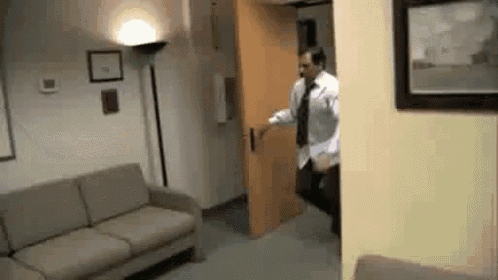

# Parkour

  

Michael Scott gets isekai'd into 15th-century Florence and explores the city with, you guessed it, parkour. He might beat Ezio Auditore in parkour!

## Development Journey

### April 6, 2026

- Created [spec v3.0](docs/spec_v3.md) using Minimax2.7 on OpenClaw, 3 iterations.
- v0.0.1 and homepage overlay.

### April 7, 2026

- v0.0.2: Added initial city slice of 15th-century Florence (Inspired by Assassin's Creed 2) and Michael proxy body.
- v0.0.3: Michael gets the movements. Some are buggy.

### April 15-20, 2026

- v0.0.4: Added Michael's rig and animations.
  - Got Michael's rigged body from [RenderPeople](https://renderpeople.com/free-3d-people/) free tier models.
  - Used [Maximo](https://www.mixamo.com) to download some basic actions for Michael.
  - Whipped out [Siddharth's Blender MCP](https://github.com/ahujasid/blender-mcp).
  - Not perfect, many animations are missing, the ones present are missing some key frames. But it's a start.

### April 22, 2026

- fix: Make the Debug HUD a toggleable option, fix camera follow.
- Getting the feeling this rig and body won't work for the game. Need to find a better way to get a more accurate rig and body.
  - PS: Andre got me jealous, his is much better looking. Check it out [here](https://x.com/andreeliasdev/status/2046670471760949553). Need to check out [Tripo](https://x.com/tripoai).
